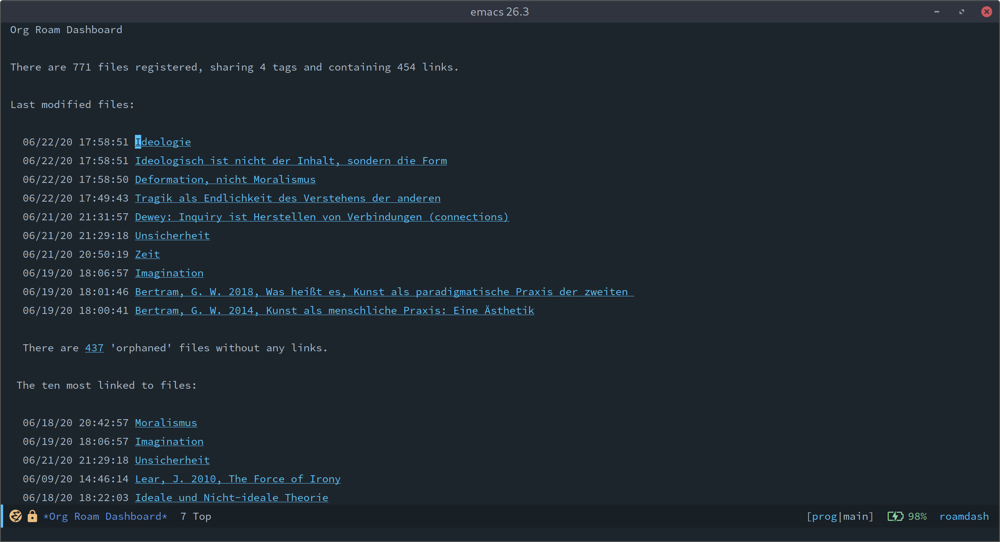

# org-roam-dashboard


THIS PACKAGE IS DISCONTINUED. USE [DELVE](https://github.com/publicimageltd/delve) INSTEAD!
===========================================================================================

A dashboard for org roam.

This package provides a dashboard to be used as a generic entry point
for using org roam.

The package is still work in progress. The idea is to expand on the
idea and to provide an ever more useful general starting place for
editing your zettelkasten.

Currently, *org dashboard* provides:

 - Some general statistics about the contents of zettelkasten.
 - A permanent list showing pages which are marked as 'sticky'.
 - A list of the last ten modified files.
 - A list of the top ten files with the highest number of links (so to
   speak the top ten of the most interesting files).
 - A shortcut to list all org roam pages which have no links, and to
   which no link is provided ('orphaned' pages).
 - Graceful handling of DB errors. If the queries do not succeed, skip
   the section and print the error message in a separate buffer.

# State of the package

`org-roam-dashboard` currently supports `org-roam` with database
version 7. Due to a breaking change coming with this version, older
versions are not supported.

This package is my personal landing page for org roam. Thus, essential
features are still missing. There are no tests and there is no support
of different versions of emacs yet.

Feel free to contribute with pull requests! 

Here is an unorganized list of things which would be nice to have, and
which I hope to add in some undefined future:

 - [ ] Links to use `rg.el` to search the zettelkasten directory with
   ripgrep.
 - [X] Provide a persistent "stash" to mark some pages for further
       use. - This is actually possible with 'sticky' pages.
 - [ ]  Display persistent "notes to self" so that you can keep notes on
   the current state of your zettelkasten project(s).
 - [X] Provide a list of some common entry points (functionally the same
   as the stash, but not relative to any project).
 - [x] Provide some basic erorr handling for the SQL queries.
 
# Screenshot



# Installation

Install the package manually (its not in MELPA yet). Then add a
keybinding to the interactive function which shows the dashboard:

``` emacs-lisp
(use-package org-roam-dashboard
   :after org-roam
   :bind
     (("<f12>" . org-roam-dashboard)))
```

# Usage

## Open the dashboard

To visit the dashboard, call `org-roam-dashboard`. It is recommended
to bind it to a key, i.e. a function key. 

## Navigating the items on the dashboard

Every 'actionable' item, e.g. a file link, is displayed using a
button. You can use the navigation keys to move point to these
buttons. For ease of navigation, the whole buffer is made "intangible"
with the exception of these buttons, so that you can quickly move
around.

## Visit a file

There are currently two file listings in the dashboard, the list of
the ten last modified files and the list of the ten pages with the
highest link number. The files are usually displayed using their
document title. To visit a file, you can press enter on the file
link, or use the mouse.

## Refresh the dashboard

After first invocation, `org-roam-dashboard` will just switch to the
buffer. Any modifications after this first visit will not be reflected
in the statistics or in the lists. To refresh this content, update it manually by pressing
`g`.

## Error handling

`org-roam` is a project in strong development, so it might be that the
database has changed after an update. To be able to treat such errors,
this package provides some error handling. Basically all calls to the
database are wrapped in a special function which catches any error
that might be produced by the query. If an error happens, the error
string plus some additional information (i.e. about the section in
which this erronous call had happened) will be inserted in a special
error log buffer, which pops up.

# Additional informations

## Sticky pages

The first section shows pages marked as sticky. Thus you can mark some
pages as common entry points for your research. A natural sticky page
would be the index file.

A page can be marked as 'sticky' by adding the tag 'Dashboard'. The
tag can be customized by changing the value of
`org-roam-dashboard-sticky-tag`. Sticky pages will be displayed in the
list until the tag is removed again.

